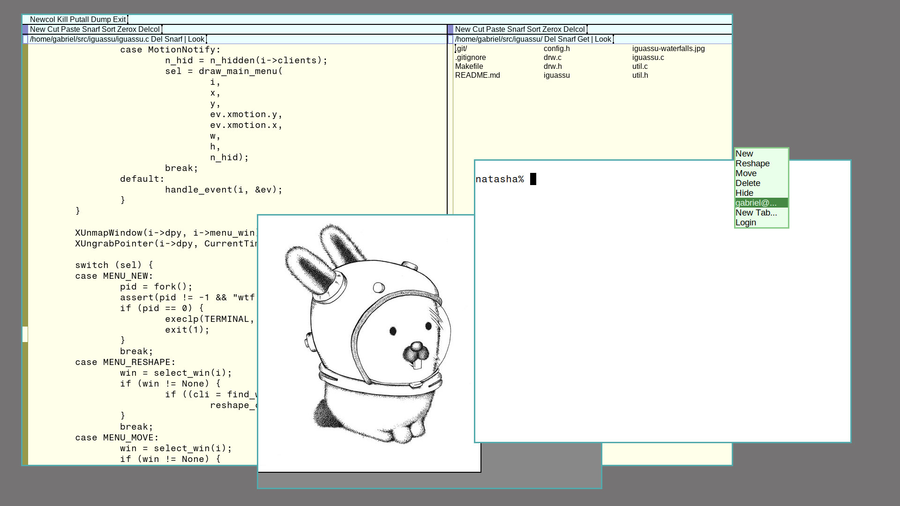

# Iguassu - rio clone for X11

Iguassu is a rio clone for X11.

Differences from Plan 9 From User Space rio:  
- Text rendering via Xft so TrueType support.  
- Configuration via source code only (`config.h`).  
- No compiled limits.  
- Two keybinds: one for fullscreen and one for reshaping.  
- Additional menu on button 1 that shows all windows.  

Stuff I still want to add in the future:  
- The autohiding of obscured windows feature from the Plan 9 version.  
- Fix the menu in 9term. Apparently, 9term repasses the button 3 click as a root
  window event and I didn't managed to differentiate it from a real click. The
  result of this is a buggy behaviour when right-clicking 9term (this happens in
  the Plan 9 From User Space rio too).  
- Multi-head support.  

## Obligatory screenshots




## Build

Iguassu depends on Xlib, Xft and freetype2. The `Makefile` uses the Tiny C
Compiler by default but you may change it to `gcc` if you don't have `tcc`.

`drw.c` is bundled in the source code. I got it from [dmenu source
code](http://tools.suckless.org/dmenu/). It's licensed under the MIT/X license,
under the names of:

```
© 2006-2019 Anselm R Garbe <anselm@garbe.ca>
© 2006-2008 Sander van Dijk <a.h.vandijk@gmail.com>
© 2006-2007 Michał Janeczek <janeczek@gmail.com>
© 2007 Kris Maglione <jg@suckless.org>
© 2009 Gottox <gottox@s01.de>
© 2009 Markus Schnalke <meillo@marmaro.de>
© 2009 Evan Gates <evan.gates@gmail.com>
© 2010-2012 Connor Lane Smith <cls@lubutu.com>
© 2014-2019 Hiltjo Posthuma <hiltjo@codemadness.org>
© 2015-2019 Quentin Rameau <quinq@fifth.space>
```

## Name

`rio` stands for "river" in Portuguese, and
[Iguassu](https://en.wikipedia.org/wiki/Iguazu_River) is a river that originates
in my hometown - [Curitiba](https://en.wikipedia.org/wiki/Curitiba), the capital
city of the state of Paraná. Near the city, it's almost dead, but it crosses the
entire state until the argentinian and paraguayan border. There, it falls into
beautiful waterfalls, and merges with the [Paraná
river](https://en.wikipedia.org/wiki/Paran%C3%A1_River), right where the borders
of the three countries join - a place called the [Triple
Frontier](https://en.wikipedia.org/wiki/Triple_Frontier).


Iguassu waterfalls, by me. Check the full-size picture at [my
website](https://gboncoffee.github.io).
